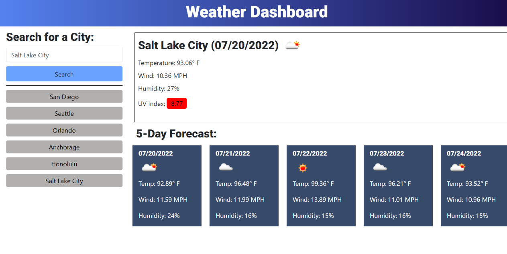

# Weather-Dashboard

## Description

- My motivation in completing this project was to apply what I learned this week about fetch, APIs, and parameters.

- I built this project because I wanted to test my skills and see if I could recreate the mock-up correctly.

- The main problems solved while working on this project were setting up parameters for the API and working through the logic needed to make the dashboard work. 

- Through this project I learned more about applying for-loops, getting local storage to render, and how to get one function to work for two different inputs by using parameters. 

- I faced many challenges with this project. One was getting my fetch set up to get the latitude and longitude for the One-Call fetch. Next, I was trying to figure out which variable.length to put in for the for-loop (turned out to be just number 5). I had an error on live deployment with a 404 error and was able to fix that with https. I needed to remember to empty my divs so that the new content would display without appending on every search. With the help of a YouTube video, I was able to set my city array to local storage and add to it with every search. I got a lot of help from Ask BCS to get my search history buttons to render the forecast on click. I learned a lot from one fellow, Michael, who taught me a lot about how to get one function to work for you with different parameters.

## Website Appearance

## Deployed Application Link: 
https://srandall1213.github.io/Weather-Dashboard/

